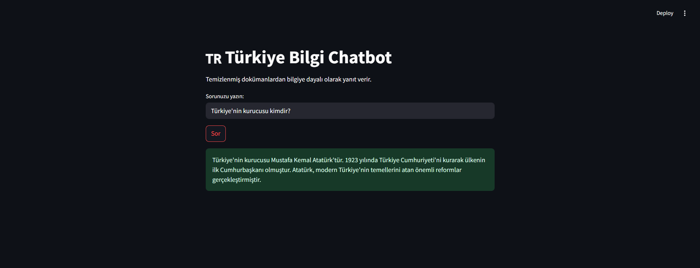
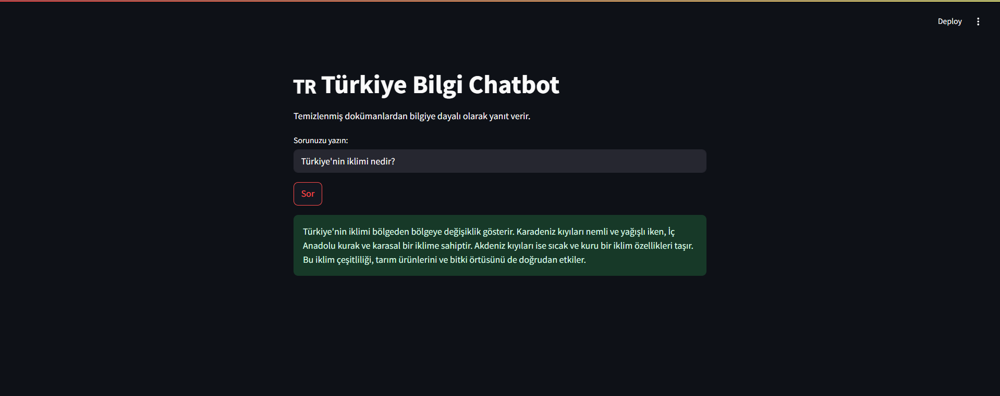

# 🇹🇷 Türkiye Bilgi Chatbot

Türkiye Bilgi Chatbot, RAG (Retrieval-Augmented Generation) mimarisiyle geliştirilmiş, Türkiye hakkında bilgi veren bir yapay zekâ asistanıdır.
Bu proje, öğrenme amaçlı bir mini RAG uygulaması olarak tasarlanmıştır ve temel RAG adımlarını (veri hazırlama, embedding, FAISS arama, GPT tabanlı yanıt üretimi) uçtan uca gösterir.


# 🧠 Proje Özeti

Uygulama, Türkiye ile ilgili belgeleri (örneğin .txt dosyalarını) analiz eder, bu belgelerden vektör temsilleri (embeddings) üretir ve kullanıcıdan gelen sorulara en uygun yanıtı GPT destekli cevaplama katmanı ile oluşturur.

Böylece model, yalnızca önceden yüklenen dosyalardaki bilgilere dayanarak güvenilir yanıtlar verir — yani “ezberden konuşmaz”, kaynağa dayalı cevap üretir.

# Deploy

https://turkiye-chatbot1-x9lebdsf9tnhcmab3qykhb.streamlit.app/






# ⚙️ RAG Mimarisi Adımları

-Veri Temizleme: Belgelerdeki gereksiz karakterler ve boşluklar temizlenir.

-Vektörleştirme (Embedding): Metinler, SentenceTransformer modeliyle sayısal vektörlere dönüştürülür.

-Vektör Veritabanı (FAISS): Embedding’ler FAISS index içinde saklanır.

-Sorgu Eşleştirme: Kullanıcının sorusu vektöre dönüştürülüp en benzer belgeler bulunur.

-Cevap Üretimi (Generation): Elde edilen bağlam, OpenAI API (GPT-4o-mini) ile analiz edilerek doğal bir yanıt oluşturulur.

# 📚 Dataset

Hazır bir veri seti kullanmak yerine, Wikipedia’daki Türkiye sayfalarından seçilen ve özetlenen bilgilerle oluşturulmuş bir öğrenme amaçlı mini veri seti kullanılmıştır.

Veriler manuel olarak hazırlanmıştır.

Her başlık (örneğin “Tarih ve Kuruluş”, “Ekonomi”, “Coğrafya”) ayrı bir metin dosyasında saklanır.

Veri boyutu küçük tutulmuştur; amaç performans değil, RAG sürecini öğrenmektir.

# 🌍 Özellikler

🔎 RAG tabanlı bilgi sorgulama: Belgelerden anlamlı bilgi çekerek GPT ile doğal yanıtlar üretir.

🧾 Wikipedia tabanlı veri seti: Bilgiler Wikipedia içeriklerinden özetlenmiştir.

💬 Doğal dilde soru-cevap: Kullanıcı, Türkçe sorularla sistemi test edebilir.

🧹 Otomatik veri temizleme: Stopword ve noktalama temizliği içerir.

📁 FAISS tabanlı arama: Hızlı ve verimli vektör benzerliği hesaplama.

💻 Streamlit arayüzü: Kolay kullanımlı bir web arayüzü üzerinden sohbet deneyimi.

# 🧩 Teknolojiler

-Backend: Python

-Web Arayüzü: Streamlit

-Embedding: Sentence Transformers (paraphrase-multilingual-MiniLM-L12-v2)

-LLM: (Cevap Üretimi)	OpenAI GPT-4o-mini

-Vektör Veritabanı:	FAISS

-Ortam Yönetimi:	Python-dotenv

-Veri Temizleme:	NLTK

# 📂 Proje Yapısı
```
turkiye-chatbot/
├── app.py                   
├── docs/
│   ├── turkiye_bilgileri.txt 
│   ├── bolumler/             
│   └── temizlenmis/          
├── turkiye_index.faiss       
├── turkiye_files.npy        
├── .env                      
├── .gitignore                
└── requirements.txt          
```
# ⚙️ Kurulum Adımları
1️⃣ Projeyi klonla
```
git clone https://github.com/silas-ictzr/turkiye-chatbot.git
cd turkiye-chatbot
```
2️⃣ Sanal ortam oluştur ve etkinleştir
```
python -m venv venv
source venv/bin/activate   # macOS / Linux
venv\Scripts\activate      # Windows
```
3️⃣ Gerekli paketleri yükle
```
pip install -r requirements.txt
```
4️⃣ .env dosyası oluştur
```
.env dosyasına OpenAI API anahtarını ekle:

OPENAI_API_KEY=your_api_key
```
5️⃣ Uygulamayı çalıştır
```
streamlit run app.py

```
Ardından http://localhost:8501
 adresinden erişebilirsin.

# 📘 Kullanım

1- Arayüzde bir soru yaz (örnek: “Türkiye’nin komşuları kimlerdir?”).

2- Model, FAISS veritabanında en ilgili bölümü bulur.

3- GPT modeli bu bağlamı kullanarak doğal bir yanıt üretir.

4- Sonuçlar kaynak etiketiyle birlikte gösterilir.

# 👤 İletişim

Geliştirici: Sıla Sultan İçtüzer

📧 E-posta: silasultann@gmail.com

🌐 GitHub: github.com/silas-ictzr

🔗 LinkedIn: www.linkedin.com/in/sılasultaniçtüzer
